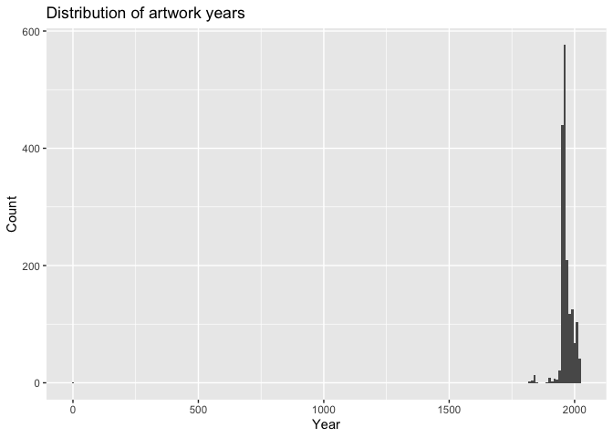
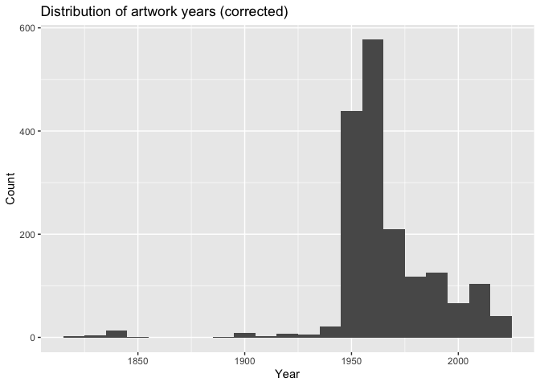

Lab 08 - University of Edinburgh Art Collection
================
Barbara Mu

``` r
setwd(dirname(rstudioapi::getActiveDocumentContext()$path)) #set wrking directory to file location
direct = setwd(dirname(rstudioapi::getActiveDocumentContext()$path)) #set wrking directory to file location
```

``` r
library(robotstxt)
paths_allowed("https://collections.ed.ac.uk/art)")
```

    ##  collections.ed.ac.uk

    ## [1] TRUE

## Load Packages and Data

First, let’s load the necessary packages:

``` r
library(tidyverse) 
library(skimr)
library(rvest)
```

Now, load the dataset. If your data isn’t ready yet, you can leave
`eval = FALSE` for now and update it when needed.

``` r
# set url
first_url <- "https://collections.ed.ac.uk/art/search/*:*/Collection:%22edinburgh+college+of+art%7C%7C%7CEdinburgh+College+of+Art%22?offset=0"

# read html page
page <- read_html(first_url)
```

``` r
titles <- page %>%
  html_nodes(".iteminfo") %>%
  html_node("h3 a") %>%
  html_text() %>%
  str_squish()
```

# Execrise 1

``` r
links <- page %>%
  html_nodes(".iteminfo") %>% 
  html_node("h3 a") %>% 
  html_attr("href") %>%
  str_replace("\\.", "https://collections.ed.ac.uk/art")

head(links)
```

    ## [1] "https://collections.ed.ac.uk/art/record/21451?highlight=*:*" 
    ## [2] "https://collections.ed.ac.uk/art/record/22040?highlight=*:*" 
    ## [3] "https://collections.ed.ac.uk/art/record/112501?highlight=*:*"
    ## [4] "https://collections.ed.ac.uk/art/record/21392?highlight=*:*" 
    ## [5] "https://collections.ed.ac.uk/art/record/21465?highlight=*:*" 
    ## [6] "https://collections.ed.ac.uk/art/record/99968?highlight=*:*"

# Execrise 2

``` r
artists <- page %>%
  html_nodes(".iteminfo") %>%
  html_node(".artist") %>%
  html_text() %>%
  str_squish()
```

# Execrise 3

``` r
first_ten <- tibble(
  title = titles,
  artist = artists,
  link = links)
```

# Execrise 4

``` r
second_url <- "https://collections.ed.ac.uk/art/search/*:*/Collection:%22edinburgh+college+of+art%7C%7C%7CEdinburgh+College+of+Art%22?offset=10"

page <- read_html(second_url)

titles <- page %>%
  html_nodes(".iteminfo") %>%
  html_node("h3 a") %>%
  html_text() %>%
  str_squish()

links <- page %>%
  html_nodes(".iteminfo") %>%
  html_node("h3 a") %>%
  html_attr("href") %>%
  str_replace("\\.", "https://collections.ed.ac.uk/art")

artists <- page %>%
  html_nodes(".iteminfo") %>%
  html_node(".artist") %>%
  html_text() %>%
  str_squish()

second_ten <- tibble(title = titles, artist = artists, link = links)
```

# Execrise 5 & 6

``` r
source("scripts/02-scrape-page-function.R")
```

``` r
scrape_page <- function(url) {
  page <- read_html(url)
  
  titles <- page %>%
    html_nodes(".iteminfo") %>%
    html_node("h3 a") %>%
    html_text() %>%
    str_squish()
  
  links <- page %>%
    html_nodes(".iteminfo") %>%
    html_node("h3 a") %>%
    html_attr("href") %>%
    str_replace("\\.", "https://collections.ed.ac.uk/art")
  
  artists <- page %>%
    html_nodes(".iteminfo") %>%
    html_node(".artist") %>%
    html_text() %>%
    str_squish()
  
  tibble(title = titles, artist = artists, link = links)
}

# Test it
scrape_page(first_url)
```

    ## # A tibble: 10 × 3
    ##    title                                                  artist           link 
    ##    <chr>                                                  <chr>            <chr>
    ##  1 Architectural Scene (1989)                             Joanne Leonie M… http…
    ##  2 William Shakespeare Otelo (1983)                       Boris Bućan      http…
    ##  3 Untitled                                               A. Parkinson     http…
    ##  4 Portrait of a Man in Profile (1951)                    Helmut F G Petz… http…
    ##  5 Rooftops                                               A McIntosh       http…
    ##  6 Madonna of the Roses (2007)                            Rachael Cawley   http…
    ##  7 Fields with Haystacks (1953)                           Iain West        http…
    ##  8 Untitled (2003)                                        Andrea Bain      http…
    ##  9 Untitled - Abstract Figures and Shapes (1965-1966)     James B. Thomson http…
    ## 10 Untitled - Still Life with Flowers and Pitchers (1963) Helen Wishart    http…

``` r
scrape_page(second_url)
```

    ## # A tibble: 10 × 3
    ##    title                                     artist                link         
    ##    <chr>                                     <chr>                 <chr>        
    ##  1 Head of a Woman Wearing Beads (1952)      Frances Walker        https://coll…
    ##  2 The Misadventure (1989)                   John Brown            https://coll…
    ##  3 Sweden - boats tied up at quayside (1963) Ann F Ward            https://coll…
    ##  4 Seated Male Nude (1953)                   Ian Short             https://coll…
    ##  5 Drawing of a Woman (12 NOV 1960)          Sheila Percival       https://coll…
    ##  6 Espresso Saucer (1920s)                   Emma Gillies          https://coll…
    ##  7 Lid (1920s)                               Emma Gillies          https://coll…
    ##  8 Night Painting (1973)                     Nicola M. Wheal       https://coll…
    ##  9 Man in His Garden (DEC 1977)              Muriel A. M. Kirkwood https://coll…
    ## 10 Untitled (2007)                           Vikki Hill            https://coll…

# Execrise 7

``` r
root <- "https://collections.ed.ac.uk/art/search/*:*/Collection:%22edinburgh+college+of+art%7C%7C%7CEdinburgh+College+of+Art%22?offset="

urls <- paste0(root, seq(0, 3320, by = 10))
```

# Execrise 8

``` r
uoe_art <- map_dfr(urls, scrape_page)
```

# Execrise 9

``` r
write_csv(uoe_art, "data/uoe-art.csv")
```

## Exercise 10

``` r
uoe_art <- read_csv("data/uoe-art.csv")
```

    ## Rows: 3321 Columns: 3
    ## ── Column specification ────────────────────────────────────────────────────────
    ## Delimiter: ","
    ## chr (3): title, artist, link
    ## 
    ## ℹ Use `spec()` to retrieve the full column specification for this data.
    ## ℹ Specify the column types or set `show_col_types = FALSE` to quiet this message.

``` r
uoe_art <- uoe_art %>%
  separate(title, into = c("title", "date"), sep = "\\(") %>%
  mutate(year = str_remove(date, "\\).*") %>% as.numeric()) %>%
  select(title, artist, year, link)
```

    ## Warning: Expected 2 pieces. Additional pieces discarded in 58 rows [111, 164, 199, 230,
    ## 245, 373, 445, 632, 642, 723, 726, 735, 819, 924, 974, 984, 1030, 1042, 1067,
    ## 1073, ...].

    ## Warning: Expected 2 pieces. Missing pieces filled with `NA` in 599 rows [3, 5, 26, 30,
    ## 33, 39, 42, 46, 60, 68, 71, 72, 80, 83, 84, 86, 90, 100, 103, 104, ...].

    ## Warning: There was 1 warning in `mutate()`.
    ## ℹ In argument: `year = str_remove(date, "\\).*") %>% as.numeric()`.
    ## Caused by warning in `str_remove(date, "\\).*") %>% as.numeric()`:
    ## ! NAs introduced by coercion

The warnings say “NAs introduced by coercion”. This happens when
as.numeric() is applied to date strings that aren’t plain 4-digit years
(e.g., “1920s”, “19 Nov 1958”, “Unknown”). This is expected and
acceptable because our goal is only to capture clean year values where
possible.

## Exercise 11

``` r
skim(uoe_art)
```

|                                                  |         |
|:-------------------------------------------------|:--------|
| Name                                             | uoe_art |
| Number of rows                                   | 3321    |
| Number of columns                                | 4       |
| \_\_\_\_\_\_\_\_\_\_\_\_\_\_\_\_\_\_\_\_\_\_\_   |         |
| Column type frequency:                           |         |
| character                                        | 3       |
| numeric                                          | 1       |
| \_\_\_\_\_\_\_\_\_\_\_\_\_\_\_\_\_\_\_\_\_\_\_\_ |         |
| Group variables                                  | None    |

Data summary

**Variable type: character**

| skim_variable | n_missing | complete_rate | min | max | empty | n_unique | whitespace |
|:--------------|----------:|--------------:|----:|----:|------:|---------:|-----------:|
| title         |         0 |          1.00 |   0 | 282 |     1 |     1635 |          0 |
| artist        |       108 |          0.97 |   2 |  55 |     0 |     1202 |          0 |
| link          |         0 |          1.00 |  57 |  60 |     0 |     3321 |          0 |

**Variable type: numeric**

| skim_variable | n_missing | complete_rate |    mean |   sd |  p0 |  p25 |  p50 |  p75 | p100 | hist  |
|:--------------|----------:|--------------:|--------:|-----:|----:|-----:|-----:|-----:|-----:|:------|
| year          |      1575 |          0.53 | 1964.75 | 53.1 |   2 | 1953 | 1962 | 1978 | 2024 | ▁▁▁▁▇ |

There are 108 works missing artist information and 1575 works missing
year information.

## Exercise 12

``` r
ggplot(uoe_art, aes(x = year)) +
  geom_histogram(binwidth = 10) +
  labs(title = "Distribution of artwork years",
       x = "Year", y = "Count")
```

    ## Warning: Removed 1575 rows containing non-finite outside the scale range
    ## (`stat_bin()`).

<!-- -->

## Exercise 13

``` r
uoe_art %>%
  filter(!is.na(year)) %>%
  arrange(year) %>%
  select(title, artist, year) %>%
  head(5)
```

    ## # A tibble: 5 × 3
    ##   title                    artist         year
    ##   <chr>                    <chr>         <dbl>
    ## 1 "Death Mask "            H. Dempshall      2
    ## 2 "Mary Ann Park Sampler " Mary Ann Park  1819
    ## 3 "Fine lawn collar "      Unknown        1820
    ## 4 "Dying Gaul "            Unknown        1822
    ## 5 "The Dead Christ "       Unknown        1831

The piece Death Mask by H. Dempshall has year = 2, which is clearly an
error. The `(2)` in the title refers to a numbering convention (it’s the
2nd piece in a series), not a date. Our code naively extracted 2 as the
year because it just looks for the first number inside parentheses. The
correct year, found by visiting the piece’s page on the art collection
website, is 1964.

``` r
uoe_art <- uoe_art %>%
  mutate(year = if_else(title == "Death Mask ", 1964, year))
```

``` r
ggplot(uoe_art, aes(x = year)) +
  geom_histogram(binwidth = 10) +
  labs(title = "Distribution of artwork years (corrected)",
       x = "Year", y = "Count")
```

    ## Warning: Removed 1575 rows containing non-finite outside the scale range
    ## (`stat_bin()`).

<!-- -->

## Exercise 14

``` r
uoe_art %>%
  count(artist, sort = TRUE) %>%
  filter(!is.na(artist)) %>%
  head(5)
```

    ## # A tibble: 5 × 2
    ##   artist               n
    ##   <chr>            <int>
    ## 1 Unknown            371
    ## 2 Emma Gillies       175
    ## 3 Ann F Ward          23
    ## 4 John Bellany        22
    ## 5 Zygmunt Bukowski    21

The most commonly featured artist (excluding unknowns) is Emma Gillies,
with 175 pieces. Emma Gillies (1898–1948) was a Scottish ceramicist and
ECA alumna. The University likely has so many of her pieces because she
studied and taught at Edinburgh College of Art, making her work closely
tied to the institution’s history.

## Exercise 15

``` r
uoe_art %>%
  filter(str_detect(title, regex("child", ignore_case = TRUE))) %>%
  select(title, artist, year)
```

    ## # A tibble: 11 × 3
    ##    title                                                            artist  year
    ##    <chr>                                                            <chr>  <dbl>
    ##  1 "The Children's Hour "                                           Eduar…    NA
    ##  2 "Untitled - Children Playing "                                   Monik…  1963
    ##  3 "Untitled - Portrait of a Woman and Child "                      Willi…    NA
    ##  4 "Woman with Child and Still Life "                               Cathe…  1938
    ##  5 "Child's chinese headdress"                                      Unkno…    NA
    ##  6 "Virgin and Child "                                              Unkno…    NA
    ##  7 "Virgin and Child "                                              Unkno…    NA
    ##  8 "Figure Composition with Nurse and Child, and Woman with Budgie… Edwar…    NA
    ##  9 "Virgin and Child "                                              Unkno…    NA
    ## 10 "The Sun Dissolves while Man Looks Away from the Unborn Child M… Eduar…    NA
    ## 11 "Child's collar. Chinese"                                        Unkno…    NA

``` r
uoe_art %>%
  filter(str_detect(title, regex("child", ignore_case = TRUE))) %>%
  nrow()
```

    ## [1] 11

There are 11 art pieces with the word “child” in their title.
